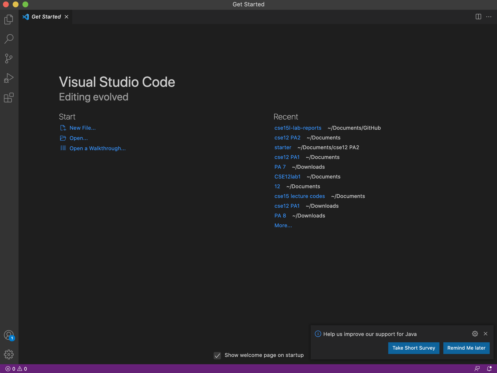
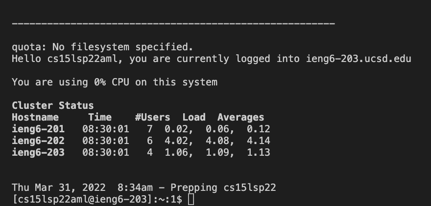
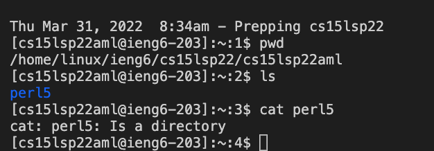
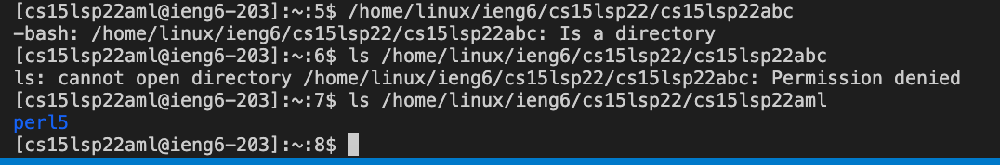
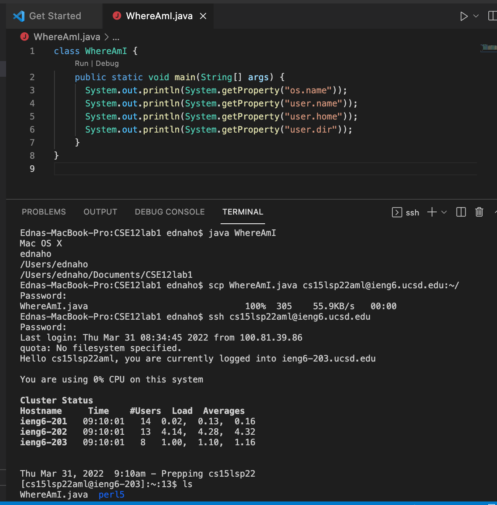
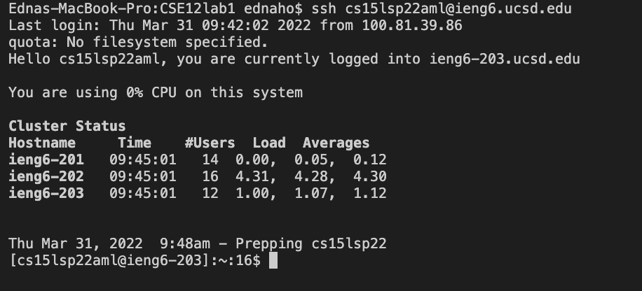
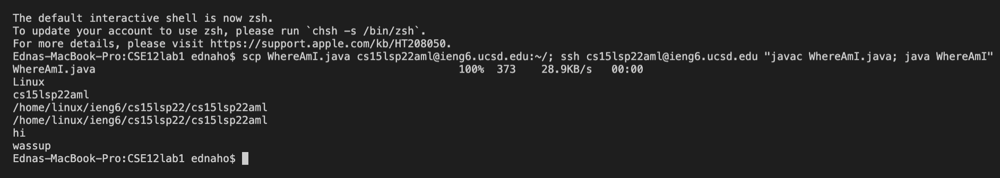

# Edna's Lab Report 1 Week 2

In week 1, we learned how to use our machines (local computer/ client) to connect to a remote computer server (ieng6) to perform our necessary work there. Here's how to do so!

**Step 1: Installing VScode**

1. Download [VScode](https://code.visualstudio.com/) and choose the correct operating system, either OSX (Macs) or Window (PC). 
    * Once downloaded, VScode should give you a "Get Started" tab to guide you in whether you would like to create a new folder or file or an existing project.

---

**Step 2: Remotely Connecting**

1. Click the 'Terminal' dropdown for VScode, and press 'New Terminal'. This will create a new terminal where we will write our commands.
2. In the terminal, there will be a '$' symbol. After the symbol, type the command: 

    `ssh cs15lsp22zz@ieng6.ucsd.edu`    
    * (the "zz" should be replaced with letters from account for the course.)

3. If it's the first time you're connecting to this specific server, a message will pop up in the terminal describing how the authenticity of the host 'ieng6.ucsd.edu..." can't be established. It will also ask if you want to continue connecting. Enter yes.
    * If this message appears when you've connected to this server multiple times already, it might mean that someone is analyzing or trying to control the connection.

4. After answering yes, it should prompt you for a password. Enter your course specific password to log in. 

    * It will not show the password even when typing because the ieng6 server is very secure
    * After entering your password, it'll give some general information on when the last login was, what percentage CPU you're using on this system, and the cluster status. The last line should read: 'Prepping cs15lsp22'
    * The terminal from your client machine is now connected to a remote server, in this case, a computer in the CSE basement for the CSE 15L course!

---

**Step 3: Trying Some Commands**

Commands can be performed both on the client laptop and on the remote computer. Commands will be performed on the client laptop unless you connect to your course specific account in the terminal using ssh.

Here are some commands to try:
* pwd: prints path to home directory
* cd: changes directory
* cd..: goes back on directory
* ls: lists what's inside the directory
* ls -at: lists file names in directory
* ls -lat: lists of files in directory in most recent order
* cp: copies a file or directory
* cat: displays what's in the file

note: using ls or cat on a directory that you don't have permission to see will deny your request to see inside

---

**Step 4: Moving Files with scp**

When trying to work *remotely*, it's beneficial to learn how to copy files back and forth between the client and remote computers. To copy files from the *client* computer to the *remote* computer, we'll use the **scp** command which should always be run from the client computer (this is before ssh-ing and logging into ieng6).
1. Create a file in VScode or choose a file from the client that you'd like to copy over to the remote server. In the terminal, type the command: 

    `scp filename cs15lsp22zz@ieng6.ucsd.edu:~/`
    * (the "zz" should be the letters from your course specific account)

        * scp: secure copy
        * filename: file wanting to be copied over
        * cs15lsp22zz@ieng6.ucsd.edu:~/: destination account

2. You'll be prompted to enter your password.
3. After entering your password, log into ieng6 with ssh. Since we're now in your account directory, use the ls command to see that the file is now in the remote computer and try compiling and running from the remote server as well!
    * To make a change to the file back on the client computer and to save it to the server again, exit the terminal to make any changes to the file from the client. Type the scp line again. Log in again. Compile and run the file on the remote server, and the new file should override and update on the remote server. 

---

**Step 5: Setting an SSH Key**

For more efficient and less time consuming workflow, creating a key that will automatically log us into the remote server without a password is very helpful. The **ssh-keygen** program creates a public key that will be copied to a location on the remote server and a private key that will be copied to a location on the client. The ssh command matches these files when you log in, so no password is necessary for logging in. 

To create a key pair:
1. After the '$' symbol in the terminal, type: 

    `ssh-keygen`
2. Enter no passphrase when prompted for a passphrase. (Just press return.)
    * You should see your key fingerprint and randomart image printed out in the terminal after successfully creating a blank passphrase.
    * Now the .ssh directory on your computer will store the private key in file **id_rsa** and the public key in file **id_rsa.pub**
3. Copy *only* the public key to the .ssh directory using the terminal:

    `$ ssh cs15lsp22zz@ieng6.ucsd.edu`

    `$ mkdir .ssh`

    `$ exit`

    `$ scp /Users/username/.ssh/id_rsa.pub cs15lsp22zz@ieng6.ucsd.edu:~/.ssh/authorized_keys`

    > now you should be able to ssh without entering a password
  

---

**Step 6: Optimizing Remote Running**
  
You can make running commands a lot more efficient with less lines!
  
* Use semicolons to include multiple commands on the same line that will carry out in order
* Use quotes around a command at the end of an ssh command to directly run it on the remote server

