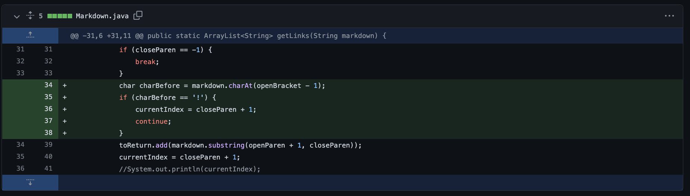

# Edna's Lab Report 2 Week 4

In week 3, we practiced debugging and differentiating between bugs and symptoms.

**Code Change #1**

I added break statements for when any one of the open bracket, closed bracket, open parenthesis, or closed parenthesis wasn't found in the string file. If all four elements are not present, the link format is not correct or there is no link present. 

[File with failure inducing input that prompted me to make this change](testfile1.md)

I debugged my code because the symptom was a OutOfMemoryError. In the test file, the closed bracket was not present. Because of the bug in my code(not accounting for if all four link elements were present or not), this created an infinite while loop since currentIndex won't change and it would keep searching for the bracket.

-----

**Code Change #2**

On top of checking if all four link elements are present, I also added an if statement to check if the open parenthesis immediately follows the closed bracket. If they're not right next to each other, the link format is not correct. (The break statement itself could be a bug since there could be another link after)

[File with failure inducing input that prompted me to make this change](testfile2.md)

I debugged my code because the symptom was an wrong answer as an output. The string "https://google.com" inside the parenthesis should not be added to the ArrayList since the closed bracket and open parenthesis are not right next to each other (incorrect link format). Because of the bug in my code (not accounting for if closet bracket and open parenthesis are next to each other), this allowed for the unwanted append of the string into the ArrayList.

----

**Code Change #3**

I also added an if statement after all four link elements have been found and the closed bracket and open parenthesis are right next to each other to check if the character before the open bracket is an exclamation mark. If there's an exclamation mark before, this is photo implementation rather than a link implementation, and thus, should not considered a link to be added. 

[File with failure inducing input that prompted me to change my code](testfile3.md)

I debugged my code because the symptom was a wrong answer output. Since there was an exclamation mark before the open bracket, the string inside the parenthesis is not a link and should not be included in the ArrayList. Because of the bug in my code (not accounting for if it could be a photo implementation), this allowed for the unwanted append of the string into the ArrayList.

