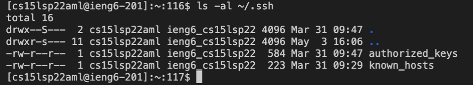
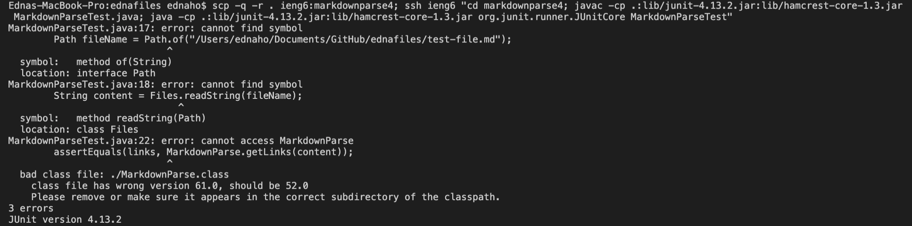

# Edna's Lab Report 3 Week 6

In week 5, we explored the capabilities of running on our ieng6 accounts. 

**Streamlining ssh Configuration**

I made a file called config in my ednafiles repository, and I used the cp command to copy that path to a new  ```.ssh/config file```. It automatically created a new config file in the lib folder of my repository.


The host name in my config file was ieng6, so all I need to do to login to my remote account now is to do ```ssh ieng6```. ieng6 is now my alias in substitute of having to type ```cs15lsp22aml@ieng6.ucsd.edu```.


I can copy a file to my account just using my alias now! It would follow as scp (filename) (destination). For my destination, I put it as the home directory of my remote account, so when I ```ls``` in the home directory of my remote account, I will see my newly copied MarkdownParse.java file


**Setup Github Access from ieng6**

In Github, under SSH and GPG keys, I made a new key by switching to ssh url in my terminal and doing ssh-keygen. I copied the key into Github. 


In my user account, my public and private key are in the .ssh directory.



To make a change to files from my remote account, I used vim to edit the file and used git add for the file I just edited. I then commit with a message and pushed to main. Now that I have my Github key, I don't need to enter a username or password!


[link for resulting commit from remote account](https://github.com/ednavho/ednafiles/commit/e4e7348b499510da4f64cb24b04e02c54b94e292)


**Copy whole directories with scp -r**

Locally, I can copy my entire ednafiles directory to my remote account by first making sure that I'm in the right directory that I'd like to copy over. Then using command ```scp -r . ieng6:markdown-parse```, it will copy it over to a new markdown-parse directory in my remote account. ```-r``` means to recursively copy. The period is to signify that *this* directory that I'm currently in is the directory that should be entirely copied over. 


After I've copied the entire directory over to my remote account, I can login and cd into the markdown-parse directory that was created, and compile and run the test file.


To copy the entire directory over and run the commands after logging into the remote account in one line, I would copy over the directory, login to the remote account, and then put in quotes to change into the correct directory with all the files as well as the compile and run lines. From this one line of commands, it compiled tester files through my remote account (however with some errors). When I login to my remote account, I can see that the new directory is copied over and all the files are inside. 




