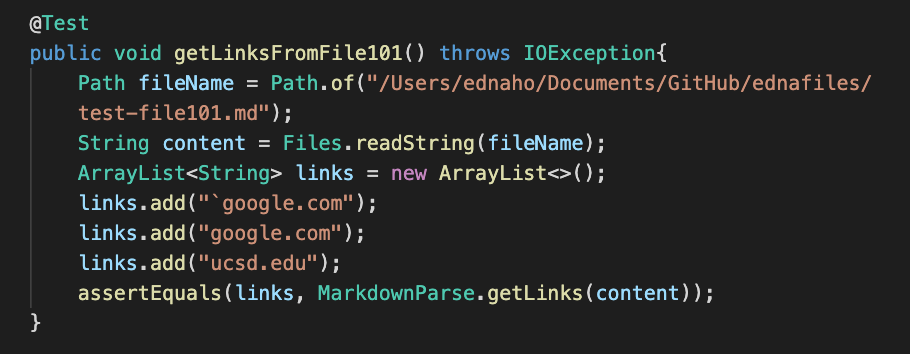
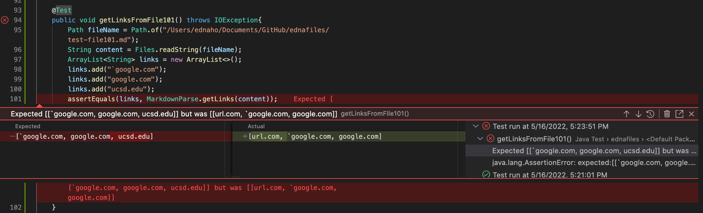
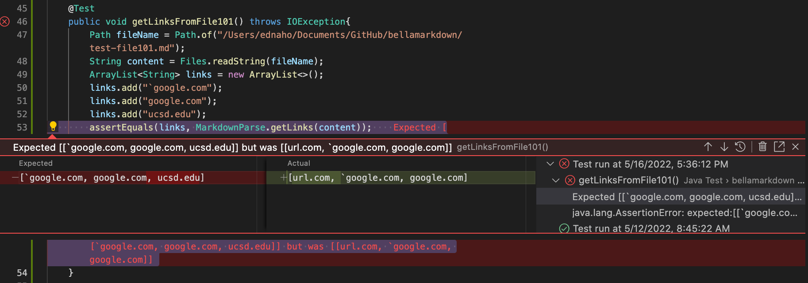
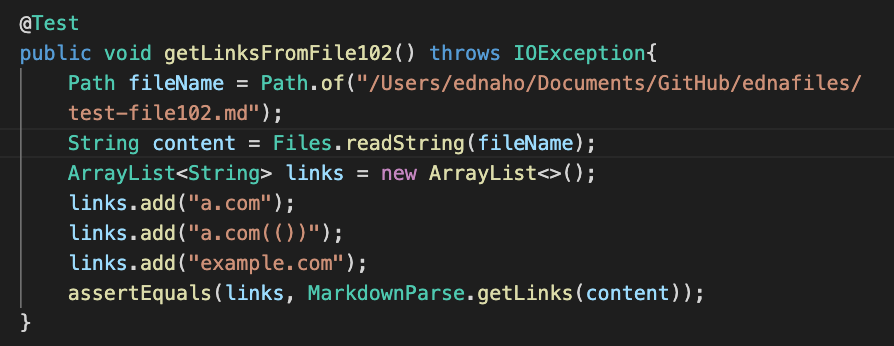
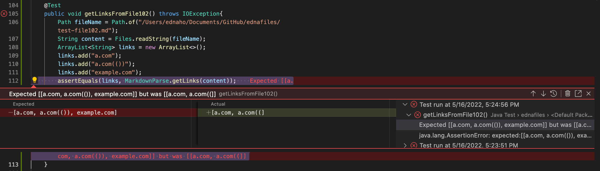
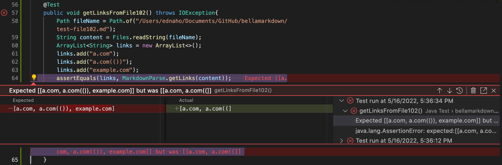
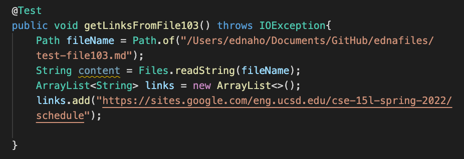
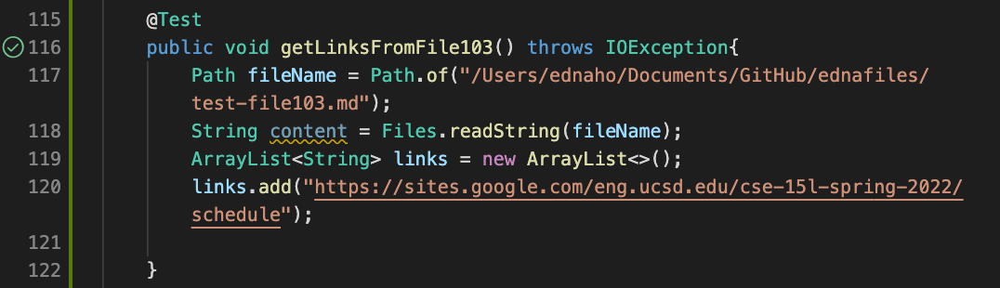
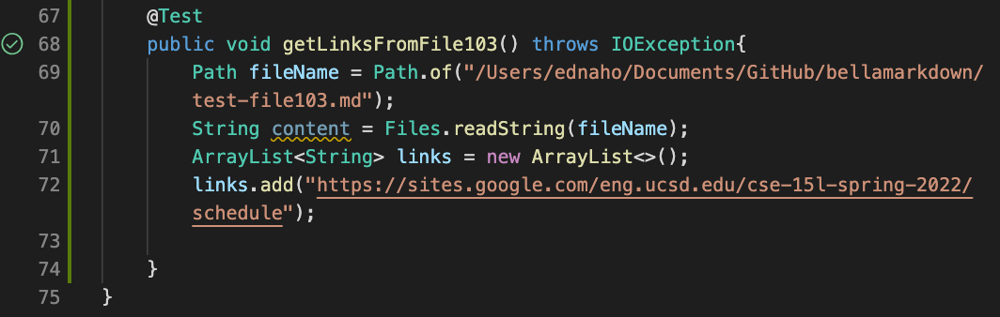

# Edna's Lab Report 4 Week 8

For the past few weeks, we've been looking into testing our code with JUnit tests and debugging according to any error messages. For MarkdownParse, I have my own implementation as well as another peer's implementation. We'll be testing each implementation with given test files to see if our implementations account for the situations.

## **Test Snippet 1**

- The expected output should be:

    ```[`google.com, google.com, ucsd.edu]```
    
- The test in MarkdownParseTest.java for each implementation should look like this:



- The corresponding output when running the JUnit test with my implementation:



- The corresponding output when running the JUnit test with my peer's implementation:




## **Test Snippet 2**

- The expected output should be:

    ```[a.com, a.com(()), example.com]```
    
- The test in MarkdownParseTest.java for each implementation should look like this:



- The corresponding output when running the JUnit test with my implementation:



- The corresponding output when running the JUnit test with my peer's implementation:




## **Test Snippet 3**

- The expected output should be:

    ```[https://sites.google.com/eng.ucsd.edu/cse-15l-spring-2022/schedule]```
    
- The test in MarkdownParseTest.java for each implementation should look like this:



- The corresponding output when running the JUnit test with my implementation:



- The corresponding output when running the JUnit test with my peer's implementation:




## **Debugging Ideas**

1. For test snippet 1, a code change could be done in less than 10 lines. After it checks for the bracket and parenthesis indices, it should check for ticks, and any existing pair of ticks near brackets should be within the pair of brackets. After checking for the closing bracket, it should check if there's another closing bracket to see if that one should be the end of the link name. 

2. For test snippet 2, a code change could be done in less than 10 lines. After checking for a certain punctuation, it should check if a duplicate follows somewhere after and update a count for that specific punctuation. Unless, it follows the case that the closing bracket and opening parenthesis are right next to each other, it should only consider the outer punctuations as the outmost link formatting.

3. The test case passed for both implementations. 

