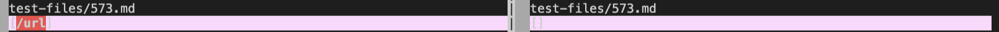

# Edna's Lab Report 5 Week 10

In week 9, we practiced using vimdiff to display the differences between the outputs of two different MarkdownParse files. The format of the output between the two were the same because we used the same script.sh file as well as the same test-file folder of tests for both.

To remotely find the different results, used vim to edit the script.sh file to include the file names before its specific output from the TA's cloned repository. I then put the output in a file called "taresults.txt". Then, I cloned my own repository for MarkdownParse in a folder called lab9markdown-parse. I copied the script.sh and test-files folder from the TA's repository onto my own repository. After running ```bash script.sh``` to see if it's running, I moved my own results into a folder called "myresults.txt". Finally, I used ```vimdiff cse15lsp22-markdown-parser/taresults.txt lab9markdown-parse/myresults.txt ``` to display the two outputs side by side. By doing so, I can see the highlighted lines where the outputs are different. 

## **First Test File With Different Outputs**

[Test File 573](https://github.com/nidhidhamnani/markdown-parser/blob/main/test-files/573.md)



On the left side is the output from the TA's implementation and on the right side is the output from my own implementation. My implementation was correct because the output was supposed to be: 

```[]``` 

since there's an exclamation mark before the link brackets and parenthesis. The inner text within the first outer pair of brackets also captured another photo link for bar. Therefore, there is no link - just a photo implementation. 

**Bug in the Code**


The bug in the code is that after checking if the double brackets are present, it should check if there's an exclamation mark before the open bracket (if the open bracket is not at index 0). If there is an exlamation mark before, currentIndex should be updated to be ```closeParen - 1```. The search should then continue, starting from the index after closeParen for any other link that might be in the file. It would find the outer brackets and parenthesis, and within the outer brackets, it would find the photo format for bar but it should be included in the outer bracket with foo. ``foo bar`` would be the name of the overall photo. 


## **Second Test File With Different Outputs**

[Test File 577](https://github.com/nidhidhamnani/markdown-parser/blob/main/test-files/577.md)


On the left side is the output from the TA's implementation and on the right side is the output from my own implementation. My implementation was correct because the output was supposed to be:

```[]```

since there's an exclamation mark before the bracket and parentheis pair. It should only be a photo implementation and should not make it a link. 

**Bug in the Code**


This test-file should also have the same bug. This test file is a bit simpler in its photo format than the first test file photo format. The implementation should check if there's an exclamation mark before the open bracket if the open bracket is not at index 0. If there is an exlamation mark before, currentIndex should be updated to be ```closeParen - 1```. The search should then continue, starting from the index after closeParen for any other link that might be in the file. 


